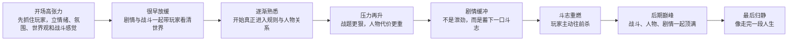

# 武侠零剧情

## 世界观基底

故事发生在一个权门、王府、帮会、镖局与江湖门派互相纠缠的武侠世界。所谓江湖并不自由，所谓秩序也并不干净。许多人都在活命，许多人也都在拿别人的命换自己的位置。

照夜门掌握一门危险的禁术心法，这门心法既能让人获得超常战斗能力，也会让人一步步走向更深的反噬与失控。正因如此，门派被各方盯上，最终引来灭门惨案。

## 故事起点

主角江照寒在灭门夜中幸存下来，多年后带着残缺心法重返江湖，开始沿着当年的血迹一层层追查。他最初只是想报仇，但很快发现这并不是一场简单的仇杀，而是一场由权势、秩序、利益和恐惧共同推动的系统性清除。

## 叙事核心

- 复仇不是简单爽快，而是越来越重
- 没有纯粹恶人，但每个人都必须为自己的选择付出代价
- 主角一路走下去，也越来越不像一个单纯的受害者

## 整体游戏节奏大曲线

这一版《武侠零》的整体节奏，不适合从头到尾只靠一条不断上升的高压线硬顶，而更适合做成一条有明显呼吸的长曲线。

这里需要先统一一个新的开场边界：

`开场不先做最高压，而是先做最高张力。`

也就是说，第一段最重要的不是立刻把玩家扔进最狠的战斗压迫里，而是先用 `情绪、氛围、世界观和战斗感觉` 把玩家抓住，再很快让真正的危险感落下来。

这里的关键不是“哪里有剧情、哪里有战斗”，而是：

- `开场` 要先抓人，也要展示世界，但重点是 `高张力` 而不是立刻最高压
- `很早放缓` 不能只靠纯剧情或纯低烈度玩法，而要靠 `剧情和战斗结合`
- `后续再加压` 需要逐步把战题、人物冲突和情绪代价一起抬高
- `最后归静` 不是泄气，而是让整部作品留下余味

如果压成一句话，这条大曲线更像：

`先让人紧，再让人静；先让人怕，再让人熟；然后一步步逼到巅峰，最后慢慢放下。`

## 单章节奏语法

在章节层面，第一版不适合把每章做成完全一样的固定模板，但适合先统一一条 `章节总方向`：

1. `教学期不加压`
2. `每学会一个关键技巧，压力抬一小档`
3. `中间要有熟悉房 / 自信房`
4. `真正高压` 放在小 Boss 前、大围杀或章节后段
5. `环境 / 侧面信息 / 剧情` 提前预告下一层压力

这条语法的重点不是机械递增，而是：

`让玩家先学会，再熟练，再在关键节点真正顶住。`

但章节的局部曲线、演出和战斗形式可以明显不同。

也就是说：

- 不同章节可以因为剧情目标不同，而拥有不同的起伏方式
- 不同章节可以因为场景和人物不同，而换成不同的战斗表达
- 某些章节甚至可以出现明显的特殊战斗段落，例如 `骑马战斗`
- 某些章节也可能拥有 `2 到 3 个小 Boss / 守关节点`

章节之间真正该统一的，不是表面形式，而是：

`它们都在让玩家经历“学会 -> 熟练 -> 变题 -> 高压兑现”这条路。`

## 章节推进原则

章节推进不能只理解为 `换场景、换敌人、换 Boss、换线索`。

更重要的要求是：

- 每一章都要改写一层 `人物关系`
- 每一章都要让主角和某一种对象的关系发生变化，例如：
  - 与仇人的关系
  - 与旧同门的关系
  - 与权力机器的关系
  - 与禁术和自己的关系
- 玩家进入下一章时，感受到的不只是“地图换了”，而是 `我对这件事、这些人、我自己，都比上一章更不一样了`

如果压成一句话，这条原则就是：

`一章的价值，不只是换场景，而是改人物关系。`

我的判断：这一点很重要，因为像《最后生还者》真正强的地方，不只是每一段在换地点，而是每一段都在改变人物之间的关系和彼此的理解。对《武侠零》来说，也应该尽量让章节推进建立在 `关系变化` 上，而不只是建立在线索推进上。

## 整体情绪曲线

- 前段：恨意、推进、立刀
- 中段：怀疑、裂痕、旧事翻涌
- 后段：压迫、反噬、承担代价
- 终局：理解之后仍然必须裁断

## 章节剧情结构

### 第一章：血夜余烬

主角确定当年外围线索，第一次顺着血债重新开刀。灭门案被揭露并非普通江湖仇杀，而是奉命清除。

### 第二章：镖路断魂

主角追上当年亲手参与屠门的执行者韩断山。杀到“真正动手的人”之后，剧情第一次显露复杂性：韩断山不是嗜杀成性，只是用别人的命换自己家人的命。

### 第三章：帮会绞盘

主角进入城市地下势力层面，发现许多人明知这案子不对，却仍一层层接手、转运、售卖、埋藏相关人和相关账册。江湖开始显得不是善恶，而是互相吞吃。

### 第四章：旧门鬼影

主角回到旧门，发现同门背叛和门派自身对禁术的执念，也是悲剧的一部分。叶惊秋的出现让主角第一次面对“如果换成自己，会不会也那样做”的残酷问题。

### 第五章：王府鹰犬

主角复仇线撞进权力机器。裴霆不是纯恶人，而是一个把秩序置于私人冤屈之上的执行者。他让主角明白，自己面对的不是一个坏人，而是一整套吃人的系统。

### 第六章：心魔燃脉

随着禁术使用加深，主角的身体和精神都在反噬边缘。剧情开始进入“即使杀到最后，主角也未必还能保持完整自我”的阶段。

### 终章：仇首之庭

主角最终面对顾承钧。此时故事的重点已经不再只是“报仇”，而是“谁有资格替那一夜做最后的裁断”。

## 剧情演出原则

- 不做长篇大段 CG 打断战斗节奏
- 每章以短戏、闪回、对峙和战后静场来推进剧情
- 对白必须短、硬、准，避免解释过多
- Boss 前后的剧情要尽量服务人物冲突，而不是服务设定说明

## 叙事表达方向

这一版剧情想追求的，不是单纯把武侠故事讲得更复杂，而是：

`表面像武侠传奇，里面其实一直在讲人怎么被时代、秩序、欲望和关系改变。`

因此，叙事表达上需要优先抓住下面几条：

- `武侠只是皮，人物处境才是骨`
- `不要只写大人物，也要写被大人物决定命运的人`
- `每一章都不只是过关，而是表达一个命题`
- `少解释，多侧写；少定论，多余味`

这几条的核心目标，不是让剧情显得“更沉重”或“更复杂”，而是让玩家在打完之后，会继续去想：

- 这些人为什么会变成这样
- 他们是怎样一步步被逼进当前位置的
- 主角一路所杀的人，究竟是恶人、可怜人，还是时代里已经被磨坏的人

如果压成一句话，就是：

`要写一个表面像武侠传奇，里面其实一直在讲人怎么被时代、秩序、欲望和关系改变的故事。`

## 叙事分层结构

为了让这类故事既有武侠传奇的表面抓力，又真的留下思考余味，更适合采用三层叙事结构：

### 1. 表层

玩家直接看到的，是清楚、锋利、能立刻进入状态的 `武侠传奇`。

这一层负责：

- 目标
- 冲突
- 刀光剑影
- 江湖压迫感
- 章节推进的表面动力

要求是：`必须清楚，不能故弄玄虚。`

### 2. 中层

玩家通过人物互动、章节命题、战斗前后状态变化，逐渐感觉到：

`这不是单纯恩怨，而是人被逼着一步步变形。`

这一层负责：

- 人物关系变化
- 章节情绪刺痛
- 玩家对人物立场的重新判断

### 3. 深层

玩家在章节结束后、甚至通关后回想时，才慢慢意识到：

`真正改变这些人的，不只是个人善恶，而是时代、秩序、欲望和关系。`

这一层负责：

- 作品余味
- 主题思考
- 对整个世界运行逻辑的回看

如果压成一句话，就是：

`表层让玩家看得懂，中层让玩家感到痛，深层让玩家回头想。`

当前确认的优先级判断是：

- `人物关系变化` 和 `每章命题的刺痛` 作为主要入口
- `整体世界运行逻辑` 作为后续逐步显出来的底色

也就是说，这部作品不应该一上来就把议题顶到最前面，而应当先让玩家先碰到 `人`，再碰到 `命题`，最后看见 `世界`。

## 讲述方式原则

当前确认，这部作品更适合按 `表层 / 中层 / 底层` 的方式去组织玩家感知：

### 表层

表层首先必须 `有意思、浅显、好进`，而且要有明确的 `武侠味` 与 `江湖味`。

也就是说，玩家最先接触到的，应该是：

- 鲜明的武侠传奇感
- 清楚的目标和冲突
- 江湖中的人情、规矩、凶险与压迫
- 让人愿意继续往下走的表面抓力

这一层的要求不是“简单”，而是：

`先让玩家愿意进入这个江湖。`

### 中层

中层更适合采用 `由点及面` 的方式推进。

不是先把整个世界讲给玩家听，而是先通过一个个人物、一个个局部处境、一次次关系变化，把更大的世界慢慢连出来。

也就是说：

- 先看到具体的人
- 再感受到这个人的处境不是孤例
- 再意识到这些处境背后，其实连着同一种世界运行逻辑

这一层的核心，不是设定展开，而是：

`从人物出发，把个人的思考扩散到全局。`

### 底层

底层不适合被作者直接下定义，更适合主要依靠玩家自己的关联、回想和思考去完成。

因此在表达上，要坚持：

- `少解释，多侧写`
- `少定论，多余味`

也就是说，作品可以把人物、关系、处境和结果摆出来，但不要急着替玩家总结答案。

更合适的状态是：

`让玩家在打完之后，自己慢慢把这些人、这些事、这个江湖怎样彼此勾连起来。`

## 剧情的最终落点

这不是一个“坏人死了，一切结束”的故事。最终被斩断的，是一整条靠妥协、恐惧和必要之恶维持下去的链条。主角完成复仇，但也必须承担自己一路走来的变化和代价。
