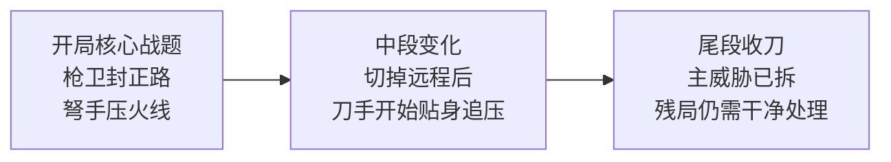

# 战斗-房间与关卡节奏

## 文件说明

- 本文件负责：房间三阶段、节奏跃迁、房间长度、战斗房成功标准
- 本文件不负责：敌人 archetype 细则、Boss 个体设计、完整势规则
- 关联规则：敌人职责见 `战斗-敌人设计.md`；Boss 见 `战斗-Boss设计.md`；势与验收见 `战斗-破势与处决.md`

## 七、房间节奏设计

这一版《武侠零》的房间，不能只是“进门杀完”。它必须像一场有明确阶段变化的危险突围战，让玩家感到：

- 开局先手不对就会死
- 中段一旦断节奏就会塌
- 收尾如果贪，也会翻车

也就是说，一间房要像一段完整的厮杀过程，而不是一个静态战斗场景。

### 7.1 房间必须有三个阶段

每个战斗房都应该天然分成：

- `开局切入`
- `中段破局`
- `尾段收刀`

这三个阶段不是形式，而是玩家体感必须明显不同。

如果要进一步落到可制作层，第一版更适合把一个 `标准战斗房` 先收成：

`一个核心战题 + 一次中段变化 + 一个收刀尾段`

这句话的意思不是把每间房做成死公式，而是：

- `核心战题`
  玩家一进门就该看懂“这间房先在考我什么”
- `中段变化`
  当玩家刚处理掉开局关键点后，房间要发生一次明确变题
- `收刀尾段`
  主威胁被拆掉后，残局仍然要有一两次判断价值，但不能拖成清垃圾

这样做的意义是，玩家打完一间房后，记住的应该是：

`这间房在考我怎么破这个局。`

而不是：

`里面有几个人。`

#### 7.1.1 标准战斗房示例：弩手 + 枪卫门厅房

这个例子里，房间的读法应该是：

1. `核心战题`
   玩家进门先看到 `枪卫` 封住正路，同时 `弩手` 在侧后高处压火线。
   这一间房的题因此非常明确：

   `你不能正面硬冲，必须先想办法断火线。`

2. `中段变化`
   当玩家刚切掉弩手，或者刚绕过枪卫，房间不应该直接变成顺手清场，而要进入新的近身压力：

   - `刀手` 贴上来
   - `枪卫` 开始转位
   - 玩家从“找路线”被推入“贴身厮杀”

   也就是说，这一间房的中段变化是：

   `你已经进局了，但现在要在近身里活下来。`

3. `收刀尾段`
   当主威胁已经被拆掉，场上可能只剩受伤的枪卫和追压中的刀手。

   这时危险还在，但局已经开始可控。尾段的重点不是拖，而是：

   - 再做一两次干净判断
   - 把残局收利落
   - 让玩家感觉自己是把这一场杀局真正收住了

### 7.2 开局切入：房间最锋利的瞬间

这一阶段的重点不是杀很多人，而是先活下来并抢到主动权。

玩家进入房间后，应该在极短时间内完成：

- 识别第一优先威胁
- 判断自己不能走哪条路
- 决定先用基础动作还是先交异能

这一阶段的正确感觉是：

`我必须马上动，不然就晚了。`

好的开局切入房，玩家一进门脑子里就会有一句话：

`先处理那个。`

### 7.3 中段破局：整间房最像“厮杀”的部分

中段不是把前面剩下的人慢慢清完，而是房间真正开始咬人的时候。

因为这时通常会同时发生：

- 追压者贴上来
- 封路者开始卡角度
- 中段门槛敌人逼你换打法
- 你可能已经断势重伤一次

这个阶段的设计重点是：

`玩家不能顺着惯性就过。`

必须让玩家在中段再做一次真正的判断：

- 现在先杀谁
- 这时要不要交燃脉
- 我要继续前压，还是先抢位置

如果一间房开局处理对了，后面就自动通，那它不够有血肉感。

### 7.4 尾段收刀：不能拖，也不能泄

房间尾段最容易被设计坏。

常见错误是：

- 主威胁死了，剩下只是追残兵
- 玩家已经赢了，但还得机械清扫
- 节奏和情绪都掉下去

这一版的尾段应该是：

- 危险还在，但已经可控
- 还需要最后一两次漂亮决策
- 清完时像一口气终于收住了

好的尾段会让玩家觉得：

`我不是把剩下的人补掉了，我是把整场杀局真正收完了。`

### 7.5 为什么房间必须有“节奏跃迁”

你要的不是喝水一样，所以房间危险度不能平。

理想节奏是：

- 开局锋利
- 中段最险
- 尾段紧，但开始可控

这样玩家才会在通关后记住：

`刚才有一段我真的差点死。`

在章节层面，这种跃迁也不应该理解成“每间房都更难”，而更适合理解成：

- 玩家 `刚学会一个关键技巧` 后，后续房间的 `敌人组合` 和 `空间组合` 会变多
- `击杀敌人所需的反应速度和判断压力` 会更高
- 但章节中间会插入 `熟悉房 / 自信房`，让玩家确认自己真的会了，而不是一直被往前推

也就是说，真正成立的章节节奏不是纯上坡，而是：

`学会一点 -> 压力抬一点 -> 熟悉一下 -> 再把新的东西组合起来。`

### 7.6 房间长度控制

为了保住短局高压，单房不能太长。

建议体验目标：

- 首次失败：15 到 35 秒
- 成功清房：45 到 90 秒
- 高压守关房或章末房：可以更长一点，但最好不要长到像一小关

因为房间越长，越容易从“突围战”变成“耐久战”。

### 7.7 一间好房的最终标准

一间真正成立的房间，玩家打完后心里应该同时有这三个感觉：

- “这房一开始就很危险”
- “中间那段我差点断掉”
- “最后我是收住了，不是混过去了”

