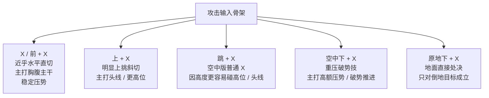

# 战斗-攻击

## 文件说明

- 本文件负责：玩家攻击输入、刀路语义、攻击组合原则、攻击风险边界
- 本文件不负责：完整势规则定义、爆头数值结算、敌人 AI、防守反应全量逻辑
- 关联规则：势、爆头、处决与反馈主定义见 `战斗-破势与处决.md`；敌人反应设计见 `战斗-敌人设计.md`

## 一、攻击输入总览

这一版《武侠零》的攻击模型，不做复杂连段背板，也不做一刀平砍到底。第一版先把玩家最常用的近战输入收成清楚、顺手、能一眼读懂的一组基础刀路。

当前确认的骨架是：

- 第一版近战输入以 `Xbox 手柄` 为主表述
- 采用 `一个主攻击键 X` 的骨架
- `X` 与 `前 + X` 使用同一基础攻击，不单独拆前向攻击
- `X` 体系允许 `边移动边攻击`，也允许 `边跳边攻击`
- `上 + X`、`跳 + X`、`空中下 + X`、`原地下 + X` 在同一体系下承担不同语义
- 差异优先靠 `刀路角度`、`命中高度`、`空间状态` 来读，不靠额外复杂规则来记

## 二、地面基础攻击

### 2.1 普通 X

`普通 X` 是玩家最常用的基础主刀。

它在第一版里的连续使用，更适合理解为 `稳推里带一点节奏变化`，而不是完全复制粘贴的机械连按。玩家可以边移动边持续把这把主刀带出来，跳起后也能自然衔接到同一套 `X` 体系里。

它的当前定位是：

- 第一优先职责是 `稳定压势`
- 主力命中区域是 `胸腹主干`
- 地面常态下不以 `头线` 为主设计
- 刀路优先理解为 `近乎水平的直切`
- 挥刀轨迹以平直快斩为主，但允许一点横向覆盖，保证常规压势时足够顺手

它不是专门抢命门的险手，而是最稳定、最直接、最容易把局面往结果推的常规主刀。

### 2.2 上 + X

`上 + X` 不是另一套复杂攻击规则，而是同一主刀在 `更高命中线` 上的一条基础刀路。

它的当前定位是：

- 主力命中区域是 `头线 / 更高位`
- 主要服务 `主动抢头`
- 刀路优先理解为 `明显上挑的斜切`
- 它不是传统挑空技，不负责把敌人明显挑离地

这一下的重点不是把敌人打飞，而是让玩家在地面常态下，清楚地做出一个简单决断：

`普通 X` 打身体主干，`上 + X` 抢头线。

### 2.3 地面两条刀路的关系

`普通 X` 与 `上 + X` 在第一版里不靠复杂参数区别，主要靠 `刀路角度` 和 `命中高度` 区别。

更适合的理解方式是：

- `普通 X` 像更直、更平的一条线，稳定取 `胸腹主干`
- `上 + X` 像更斜、更抬的一条线，主动碰 `头线 / 更高位`

也就是说，玩家记住的不是两套规则，而是两条刀路。

## 三、空中攻击

### 3.1 跳 + X

`跳 + X` 在第一版里优先理解为 `空中版普通 X`。

它不是单独拆出来的一手新攻击，而是把地面常规主刀带到了空中。因为高度变化，它会更自然地碰到：

- 高位目标
- 头线
- 原本在地面常态下不容易稳定打到的位置

它的收益主要来自 `空间关系变化`，不是来自一套新的额外语义。

### 3.2 空中下 + X

`空中下 + X` 已明确和 `原地下 + X` 分开。

它在第一版里的核心语义是：

- `重压破势技`
- 第一优先收益是 `高额压势 / 破势推进`
- 不是空中处决
- 不是空中万能重攻击

这一下更接近：

`我不是在拿命，我是在把你的势往下砸。`

手感边界当前收成：

- 重量感主要落在 `落地后摇`
- 命中与空挥都只有 `轻微落地后摇`
- 它的代价来自动作本身的重量，不来自空挥重罚

## 四、地面处决输入

`原地下 + X` 在第一版里已经明确收成 `地面直接处决输入`。

当前只保留最必要的输入摘要：

- `严格条件触发`
- `只对倒地目标成立`
- 允许 `近身小吸附`
- 用于地面近身收命，而不是普通重攻击

具体的势结算、处决窗口、高阶敌人闪避处决后的交换关系，不在本文件重复展开，统一以 `战斗-破势与处决.md` 为主。

## 五、攻击与破势的关联摘要

这一版攻击文档只负责说明：`哪些攻击更容易参与高价值结果`，不在这里重复定义完整势规则。

当前确认的关联摘要是：

- `爆头` 是通用高价值命中，不管用什么方法打到头，都应当算奖励
- `普通 X` 更适合稳定打主干、稳定推进
- `上 + X` 更适合主动抢头线
- `跳 + X` 因高度更自然地碰到高位和头线
- `空中下 + X` 主要负责重压推进，不负责直接拿结果
- `原地下 + X` 负责已经拿到倒地结果后的地面处决

具体到 `爆头掉多少势`、`不同敌人如何结算`、`处决窗口怎么开`，统一以 `战斗-破势与处决.md` 为主定义处。

## 六、攻击组合原则

这一版《武侠零》的攻击组合，不鼓励长连段背板，而鼓励 `短、准、知道为什么挥` 的两三手。

当前更适合的组合理解是：

- `普通 X -> 普通 X`
  用于最稳定地持续压势
- `普通 X -> 上 + X`
  用于先稳拿主干，再主动抢头线
- `跳 + X -> 落地续压`
  用于借空间变化切高位
- `空中下 + X -> 地面续压`
  用于先重压推进，再继续把局拆开
- `破口已成 -> 原地下 + X`
  用于把地面结果坐实

在玩家常态判断上，第一版更适合优先形成两个本能：

- `第一反应`：看到头线就 `上 + X`
- `第一结果动作`：目标倒地就 `原地下 + X`

所以这套系统的关键不是“连得长”，而是：

`每一手都知道自己在抢什么。`

## 七、攻击风险边界

为了保住厮杀感，不同攻击的风险边界应该清楚，但第一版不靠复杂参数去记。

当前更合适的理解是：

- `普通 X`
  最稳定，最适合持续推进
- `上 + X`
  价值更高，但核心风险来自 `主动抢头线` 这件事本身
- `跳 + X`
  风险主要来自空间位置与落点判断
- `空中下 + X`
  风险主要来自动作重量与轻微落地后摇
- `原地下 + X`
  是最明确的拿结果输入，条件最硬，失败交换也最清楚

这一版要保住的不是“每一刀都差很多参数”，而是：

`玩家一按出去，就知道自己是在稳推、抢头、借高位、往下砸，还是拿结果。`

