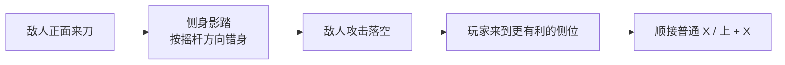

# 战斗-玩家动作与异能

## 文件说明

- 本文件负责：基础动作定位、动作手感、燃脉、影踏，以及当前已确认的动作语言
- 本文件不负责：具体攻击输入规则、敌人设计、Boss 与破势细则
- 关联规则：攻击细节见 `战斗-攻击.md`；Boss 与势规则见 `战斗-Boss设计.md`、`战斗-破势与处决.md`

## 四、主角动作与异能设计

这一版战斗里，主角动作设计的目标不是把玩家做成一个纯炫技角色，而是让玩家在高压围杀里，始终有办法“硬抢一条活路”。

### 4.1 基础动作的定位

基础动作必须先够快、够狠、够直接，但不能太花。

当前先统一一个很重要的边界：

- `常态移动 / 跑动 / 疾行移动` 是同一个概念
- 它不是需要额外触发的冲刺技
- 玩家最普通的移动状态，默认就是较快的跑步姿态
- 角色在常态下就应该带着随时切入、随时换位的战斗感

动作职责如下：

- `常态移动 / 跑动`：承担最普通的切入、换位与走线，是玩家默认的战斗移动状态
- `跳跃`：用于跨层、避开低位危险、抢高度
- `蹬墙`：让狭窄空间和楼阁空间里的路线变立体
- `飞刀 / 袖箭`：用于打断、逼反应、补最后一口节奏
- `近身处决`：给清房结尾一个狠而利落的收束

第一版当前不额外拆出一个独立的 `滑步` 输入。

此前 `滑步` 想承担的那部分职责，先统一并入 `影踏`：也就是 `短脱险`、`钻角度`、`抢半身位` 这类更激烈的近身变位，先不额外加一套新操作，而是交给 `影踏` 负责。

关键原则：

`基础动作就应该能救命。`

异能是放大器，不是轮椅。

### 4.1.1 跳跃：普通但必须顺手

第一版的 `跳跃` 不需要额外做成一套复杂的系统招式。

它就是 `普通的跳跃`。

但这里的“普通”，不是无关战斗，而是：

- 默认就能参与战斗
- 默认就能拿来换线
- 默认就能在跳跃过程中接攻击

当前更适合参考的体感方向，是《武士零》《空洞骑士》这类 `清楚、直接、顺手、默认能接战斗动作` 的基础跳跃。

所以这版 `跳跃` 先按下面几条边界来收：

- `基础定位`：抢高度与换线的基础动作
- `核心手感`：起跳快、滞空短、落地利落
- `第一价值`：跳起来也能继续打

也就是说，玩家最先感受到的，不是“我跳起来躲了什么”，而是：

`我跳起来，这套战斗还在继续。`

它和攻击文档的接口也因此很明确：

- `跳跃` 本身写在本文件
- `跳 + X` 作为空中版普通攻击的具体语义，继续以 `战斗-攻击.md` 为主定义处

这一版先不把跳跃写成高复杂度空中系统，也不把它写成专门的防守跳。

更合适的理解是：

`跳跃是最普通的立体换线动作，而不是离开战斗的动作。`

### 4.1.2 蹬墙：把墙变成路线

第一版的 `蹬墙` 先按两种成立场景来理解，而且两种都保留：

- `主动贴墙型`
  正面有墙时，玩家可以跳到墙上
- `受击贴墙型`
  玩家被击飞到空中、靠近墙壁时，可以借墙救回或反打

但在教学顺序上，第一版更适合先让玩家学会 `主动贴墙型`，再学 `受击贴墙型`。

#### 主动贴墙型

当前先把这一路线收成最基础、最常用的立体路线动作。

它的核心不是挂墙打架，而是：

`把墙从背景变成突围路线和关卡跳点。`

也就是说，玩家跳上墙以后，第一版先按下面几条边界来理解：

- 可沿墙 `短走几步`
- 最常用、最先学会的后续动作是 `跳走`
- `空中 X` 自然成立，不另起新规则，默认沿用普通跳跃中的空中攻击逻辑
- `原地下落` 只是自然松手掉下，不特别强调

这一版不做持续挂墙，也不把墙上状态写成另一套复杂系统。

更合适的理解是：

`墙面是一个短暂的立体路线节点，而不是安全停留区。`

在可用范围上，当前第一版先按更开放的方向来收：

`大部分看起来合理的墙都能用。`

这样做的好处是，玩家更容易自然把墙读成可借力的空间，而不是只有个别发光跳点才敢去碰。

#### 受击贴墙型

在玩家已经理解“墙可以变路线”之后，再进一步学会 `受击贴墙型`。

它的输入和结果当前先收成：

- `墙方向 + 跳跃`
  打出 `蹬墙跳`
- `墙方向 + 跳跃 + X`
  打出 `蹬墙反击`

其中 `蹬墙反击` 明确是高难度动作。

它的价值不是把受击洗成奖励，而是让高手在最坏的位置里，仍然有机会从墙上抢回一口气。

### 4.2 动作手感要求

主角必须灵，但不能像没有重量。

正确的感觉应该是：

- 起动很快
- 换位很果断
- 出手很利
- 但每一下都有身体重量和风险

也就是说，主角不是羽毛，也不是坦克，他应该像一把贴着命在用的快刀。

### 4.3 当前已确认核心异能

#### 燃脉

`燃脉` 不应该只是“开加速很爽”，它的真正职责是：

`在局面要塌之前，把主动权硬抢回来。`

它最适合服务三个瞬间：

- 开局先手切入
- 中段被围时强行拉回节奏
- 最后几秒连续收刀

它不是“无敌爆发”，而是 `短时间全面提速的爆发状态`，而且这个提速不只是跑得更快，而是让玩家整个人进入：

`我现在能把节奏硬抢回来。`

### 燃脉的核心效果

第一版里，`燃脉` 开启后先统一按下面三点理解：

- `所有动作都会变快`
- `各种判定都会更加宽松`
- `击杀后的连续推进能力更强`

玩家最先、最明显感受到的爽点应该是：

`我整个人明显变快了。`

### 燃脉的状态感

这一状态必须在第一时间同时被玩家看见、听见、感觉到：

- `动作与动画节奏明显变快`
- `拖尾 / 火纹`
- `音效明显强化`
- `头发在开启瞬间快速变长，并随着 2 秒燃脉时间逐步变短`

也就是说，`燃脉` 的辨识度不能只靠数值变化，而要让玩家一眼就知道自己已经点燃了这口气。

### 燃脉的开启规则

第一版当前确认的开启规则如下：

- `输入`：`LT + RT`
- `随时手动开启`
- `开启时立刻消耗 1 个势豆`
- `持续 2 秒`
- `可以连续再次开启`
- `主角势上限为 3`
- `开局没有势`
- `剩余时间直接由主角自己的势豆燃烧缩短来表现，不另出独立计时条`

### 燃脉的回势逻辑

`燃脉` 不是白开的，它的代价已经收在 `消耗自己的势豆` 上；而势豆要靠战斗结果回补。

当前第一版的回势来源只收两种：

- `敌人掉一个势豆时，主角回 1 个势豆`
- `敌人被主角亲手杀死时，主角回 1 个势豆`

这里的重点不是“随便打两下就回”，而是：

`只有真正拆掉敌人的一层势，或者亲手把人杀死，你这口狠劲才会续上。`

在续势优先级上，第一版更适合先让玩家明显通过 `拆敌人势豆` 把燃脉续起来；`亲手击杀` 也能回势，但更像结果奖励。

当前第一版默认不讨论其它死亡来源，也不把环境击杀、队友击杀或脚本死亡等情况纳入回势条件。

### 燃脉的代价边界

第一版里，`燃脉` 不额外附带惩罚。

也就是说，它的代价已经完整收在：

- `你要主动花自己的势豆`
- `而这些势豆必须靠拆敌人势豆或亲手击杀回补`

除此之外，第一版暂不追加“更脆”、“结束硬直”或其它额外罚则。

#### 断息（名称保留）

`断息` 当前取消现有功能定义。

这个名字先保留，后续如果要用于别的系统、能力或机制，再单独讨论确认。

在第一版当前文档里，不把 `断息` 视为已经落地的现行功能。

#### 影踏

`影踏` 是最能体现武侠气质的能力，但它不能只是酷。

它真正的职责是：

`把一个本来必死的位置，改成能活的位置。`

它可以用来：

- 在近身里短脱险、钻角度、抢半身位
- 穿过火线切后排
- 从包围边缘突然换边
- 抢高点
- 追最后一个危险目标
- 在断势重伤后硬抢一线生机

它的设计重点不是位移距离，而是：

`它能不能改变局面。`

第一版里还要再明确一条实现边界：

- `影踏` 先同时承担原本想交给 `滑步` 的职责
- 不额外增加一套独立滑步操作
- 先用更少的位移输入，把 `普通移动` 和 `改局面位移` 的差别立住

### 4.3.1 侧身影踏：第一版基准形态

当前第一版先把 `侧身影踏` 立成 `影踏` 的基准形态。

它最值钱、最先该被玩家学会的使用时机，不是乱局里随便交，而是：

`贴近敌人正面来刀时，贴身把线错开。`

这一下的核心不是拉开距离，而是：

- 仍然留在近身
- 从敌人的正面危险线里挪开
- 把自己换到更有利的侧位
- 立刻接回进攻节奏

这一版的 `侧身影踏` 先按以下边界收：

- `方向判定`：按 `摇杆方向` 错身，不做自动绕背
- `距离感`：以 `半步到一步` 的短错身为主，不做大范围脱离
- `后续动作`：成功后几乎可以立刻接 `普通 X / 上 + X`
- `失败代价`：不是保底无敌；如果方向按歪，而敌人的攻击又正好到了，就直接受伤

也就是说：

`影踏不是保命按钮，而是一记高价值的近身换线。`

它的第一层成功反馈必须先让玩家明确：

`敌人的刀落空了。`

第二层再明确强调：

`我已经换到对的位置了。`

所以这一版的成功感，主要靠下面两件事共同成立：

- `动作姿态 + 敌我相对站位`
  让玩家一眼看懂自己已经从正面错到侧位
- `音效 + 镜头辅助`
  让“刚好错开并立刻反打”的爽点被放大出来

需要特别注意的是，`影踏` 成功后的强化，当前主要落在 `动作表现与反馈强化`，不额外写成另一套专属攻击规则。也就是说，后续衔接的仍然是现有的 `普通 X / 上 + X` 体系，只是起手姿态、过渡节奏和命中反馈会更锋利。

### 4.4 为什么这一版动作与异能会形成“突围感”

因为当前已经确认下来的分工也很清楚：

- `燃脉`：抢节奏
- `影踏`：抢位置
- `跳跃 / 蹬墙`：抢路线

于是整套战斗的语言变成：

玩家不是在秀技能连招，而是在围杀中不断抢 `时间`、`空间`、`生路`。

> 以下 `4.5`、`4.6`、`4.7`、`6.5`、`9.8` 为待讨论确认草案。它们是提前写入文档的细化方向，后续需要按 `/brain` 讨论结果修订或删除，不能视为最终定稿。

